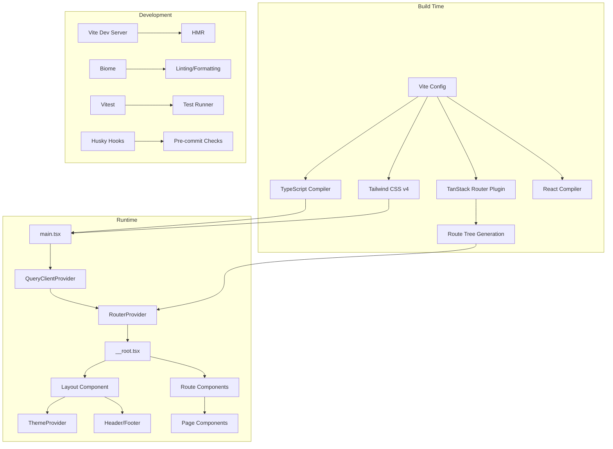

# アーキテクチャ

## 概要

このテンプレートは次の要素で構成されています。

- **高速な開発**: Vite による HMR とビルドパイプライン
- **型安全性**: 厳格モードの TypeScript
- **ルーティング**: TanStack Router によるファイルベースルーティング
- **スタイリング**: ダークモード対応の Tailwind CSS v4
- **状態管理**: サーバー状態用の TanStack Query
- **コード品質**: Biome（リント/フォーマット）、TypeScript、テスト
- **開発体験**: DevTools、環境変数検証、PWA 対応

## アーキテクチャ図

## コアモジュール

| モジュール | 場所 | 役割 |
|-----------|------|------|
| **ルーティング** | `src/routes/` | ファイルベースのルート定義、自動生成されるルートツリー |
| **ページ** | `src/lib/pages/` | ルート別に整理されたページコンポーネント |
| **レイアウト** | `src/lib/layout/` | アプリのシェル（Header、Footer、Layout ラッパー） |
| **コンポーネント** | `src/lib/components/` | 再利用可能な UI（ThemeProvider、ThemeToggle） |
| **サービス** | `src/lib/services/` | 共通サービス・定数（QueryClient） |
| **ユーティリティ** | `src/lib/utils/` | 純粋なユーティリティ関数 |
| **スタイル** | `src/lib/styles/` | グローバル CSS と Tailwind 設定 |

## テンプレートが提供するもの

- 本番用ビルド設定
- 型安全な環境変数検証
- コード分割を伴うファイルベースルーティング
- ダーク/ライト/システムのテーマ
- Vitest によるテスト環境
- コード品質を強制する Git フック
- Vercel / Netlify / Cloudflare Workers 向けデプロイ設定

## テンプレートが提供しないもの

- バックエンド API 実装
- 認証・認可ロジック
- データベース連携
- TanStack Query 以外の状態管理ライブラリ
- 基本的なレイアウト以外の UI コンポーネントライブラリ
